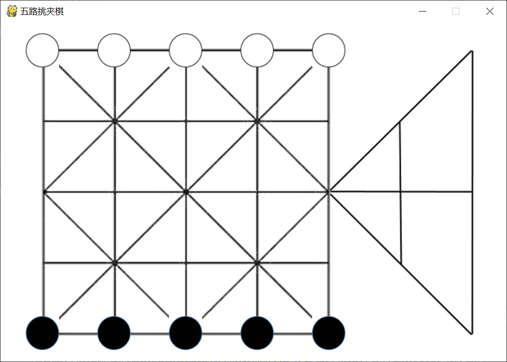

## 游戏：五路挑夹棋
* 该游戏基于基于Pygame开发而成，运行界面如图：
* 直接运行game_main.py即可

## 游戏规则
一、每方五枚棋子初始布置于己方底横行，另外每方五枚作备用。

二、每方轮流移动一枚己棋，沿纵横斜线可任意步，但不得有子抵挡或转弯。

三、行棋时主动排成以下两种排列之一就把该些敌子移除，并在该棋位补放同数量己子。
* 1.夹死（二夹一）：两枚己棋在一条直或斜线上夹住一枚敌棋，同时该线上不能有对方的棋子。（称为抬子或包围）
* 2.挑担（一挑二）：一枚己棋至两枚敌棋的中间，同时该线上不能有对方的棋子。（称为挑子或进攻）

四、将对方吃的只剩下一颗棋子，并将该棋子逼至葫芦的中心即获胜